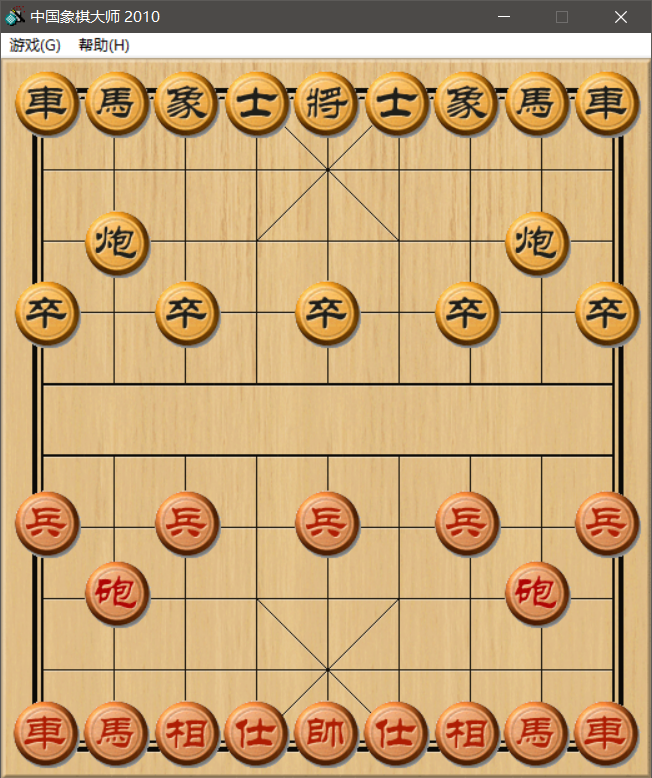
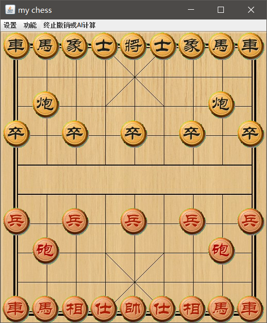
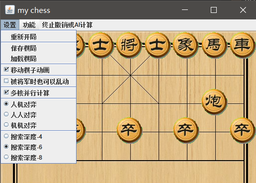
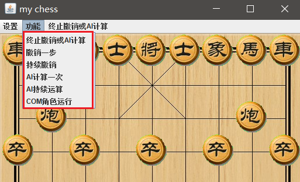

# my-chinese-chess

基于java swing的象棋游戏, 人机对弈基于极大极小值搜索算法

## 我是为什么会学习编程呢?

最初对程序感兴趣是因为我接触到一款FC小游戏--中国象棋

我从小学一年级就喜欢象棋, 那时候放学回家就缠着家里人下象棋, 然而同龄人根本下不过我, 家里大人也没什么时间, 直到我接触到红白机(小霸王游戏机)上面的一款`中国象棋`游戏, 游戏中的棋手居然能够像真人一样和我下棋, 而且一次又一次将我打败, 当时我就对红白机的各种游戏特别的好奇, 那段时间我对家里小霸王游戏机爱不释手.

随着年龄的增长, 我了解到世界上居然有程序猿这种生物, 而红白机的各类游戏都是程序猿们做的, 当时我就迸发出一个梦想, 我想做一款中国象棋游戏.

在完成象棋之前, 我先做了一个五子棋AI练了下手, 五子棋做的差不多了, 于是就开始了制作象棋的小游戏.

## 历程

这个象棋游戏, 其实从2018年开始, 就开始做了, 只不过一直是三天打鱼两天晒网(每年都做, 但每年只做一点), 期间换了两台电脑, 连git仓库都换了一次.

2021年12月, 这段时间刚好有了事件, 连续奋斗了十几天时间, 今天(2021年12月23日)总算是可以出一个release版了.

虽说还有一些优化空间, 并且棋力也不高, 估计只有象棋大师里面的里面的菜鸟级.

但是实在耗了太长时间了, 还有很多其他事情没有做, 等后续有时间再优化吧!

## 内容

里面的工程结构, 设计模式, 代码, AI设计均是自己一点点搞出来的. 也没有看别人的代码以及AI设计.

里面的代码还算是优雅, 有逻辑, 注释也打的比较满!

但是 AI 棋力很差, 估计只有象棋大师里面的里面的菜鸟级.

不过也可以虐一些人了, 不认真的话自己都干不过搜索深度为 6 的 AI.

## 画面声音

懒得制作画面和声音了, 直接解压 `象棋大师2010.exe` 取出来了里面的 声音, 棋盘, 棋子.

象棋大师游戏画面

   

我的象棋游戏画面

   

我的象棋设置菜单

   

我的象棋功能菜单

   

## TODO

### 棋盘问题

1. 棋盘没有放大和缩小的功能.
2. 音频播放末尾有爆音(尤其是COM落子后的声音).
3. 添加日志区, 或者要加个状态栏, 显示一些信息.
   > 参考我的另一个 `endpoint-io-transfer` 里面的日志区
   > - github: <https://github.com/cpfree/endpoint-io-transfer>
   > - gitee: <https://gitee.com/cpfree/endpoint-io-transfer>

### 搜索问题

1. 没有算杀策略
   > 我不知道象棋AI里面应不应该有算杀, 但是我做的五子棋AI里面是有算杀的, 但是在象棋里面写算杀的时候, 棋力似乎没有多大增加, 甚至造成了一些bug, 后续再研究吧!
2. 在动态调整搜索深度中导致转变搜索深度的时候, ai运行速度大幅下降
3. 棋子走法单一
   1. 并行计算的时候还好, 串行计算的时候就太单一了.
4. 棋子进攻性较强, 不懂得防守.
5. 一些棋子随着时间的变化, 棋子力度应该不一致, 这个没有体现出来, 例如早期炮比较强, 后期马比较强.
6. 随着棋子的计算, 权重也不一样, 例如, 我方两个車, 敌方一个車, 那么对于我方拼掉两方的车比较有利, 对于敌方拼掉車很不利.
7. 重复步骤问题, 没有对重复走棋有判定, 导致AI会重复走棋

